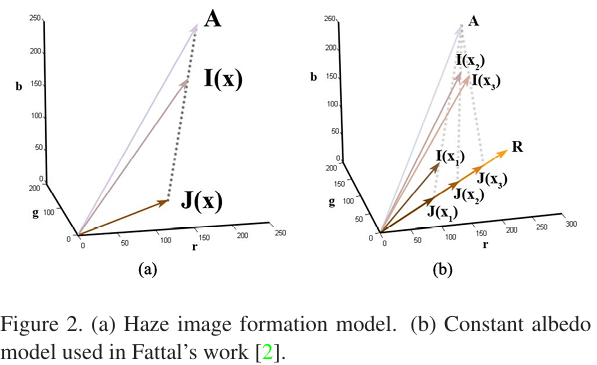
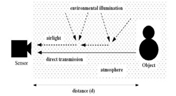

# Defog - Dark_Channel_Prior_2:Basic model and Cover by Object Distance

*Even the brightest and most vibrant scenes cannot escape their inherent shadows.*

The model widely used to describe the formation of a hazy image is

$I(x) = J(x)t(x) + A(1 - t(x))$ [what you see = Real image***distortion** + Noise]

I is the observed intensity
J is the scene radiance.
A is the global atmospheric light.
The first term J(x)t(x) on the right-hand side is called direct attenuation , and the second term A(1-t(x)) is called airlight.

t is the medium transmission describing the portion of the light that is **NOT** scattered and reaches the camera. 

The goal of haze removal is to recover **J, A, and t from I.** 
From the above equation, we got the colinear system in RGB scalar like:

---

---

(it’called Markov Random Field, often used in ISP filed to show random distribution of color system)

$$
I(x) - A = t(x)\,(J(x) - A) *(-1)
$$

$$
=> A - I(x) = t(x)\,(A - J(x))
$$

$$
\|A - I(x)\| = t(x)\,\|A - J(x)\|
$$

$$
t(x)= \frac{\|A - I(x)\|}{\|A - J(x)\|}
$$

$$
A_c - I_c(x)= t(x)\,(A_c - J_c(x)) (c \in {r,g,b} from figure2)
$$

$$
t(x)= \frac{A_c - I_c(x)}{A_c - J_c(x)}
$$

For an N-pixel color image I, there are 3N constraints and 4N+3 unknowns.

> [Single image haze removal using dark channel prior | IEEE Conference Publication | IEEE Xplore](https://ieeexplore.ieee.org/document/5206515)
> 

[But what’s x ①? Is it the distance to object or the 2D location?  Is A an amplitude **②**?] Let split the formula in detail.

The optical model of the bad weather derived into two terns:

$$
I(x)=L_{\infty}\rho(x)e^{-\beta d(x)}+L_{\infty}\left(1-e^{-\beta d(x)}\right).
$$

First tern is the direct attenuation, and the second term is the airlight. 

I is the image intensity. 
[① x is the 2D spatial location. ]
$L_{\infty}$(A) is the atmospheric light, which is commonly assumed to be globally constant**②, yes, it’s an amplitude]**; thus, it is independent of location x. 
ρ(x) is the reflectance of an object in the image. 
β is the atmospheric attenuation coefficient. 
d is the distance between an object in the image and the observer.

> [Visibility in bad weather from a single image | IEEE Conference Publication | IEEE Xplore](https://ieeexplore.ieee.org/document/4587643)
> 

Now, we have the conditions:

1. In the nature image, one of every RGB values is closed to zero.
2. While cameras capture an object, the image signal is both composed by object direct attenuation and scattered light from everywhere(airlight).
3. The materials we have are 
    1. x, position
    2. I, intensity
    3. Assume the **object distance d is unlimited(sky region),**  $e^{-\beta d(x)}$ (t(x))is 0. 
     $I(x)=L_{\infty}(A)$. All signal intensity depends on the enviroment light.
    4. Assume there is **no effect of scattering particles (**$e^{-\beta d(x)}$ **=1)**
      $I(x)=L_{\infty}\rho(x)(J(x))$, All signal intensity are equal to light reflected by object. make sense, but not in reality. **Haze still exists when we look at distant objects, and it is a fundamental cue for human to perceive depth, so we would lower the equation for keep very small amount of haze.**
    5. From c. and d., $t(x) \in [0,1]$ , so
     $\|A - I(x)\| = t(x)\,\|A - J(x)\| \rightarrow\,\|A - J(x)\| >\,\|A - Ｉ(x)\|$ 

#### ***It is based on a key observation - most local patches in haze-free outdoor images contain some pixels which have very low intensities in at least one color channel.***

[Even the brightest and most vibrant scenes cannot escape their inherent shadows.]

$$
J^{dark} \rightarrow 0
$$

in haze-free image

$$
\frac{I(x)}{A} = \frac{J(x)t(x)}{A} + (1 - t(x))
$$

assume the tranmission t(x) is a constant in patch Ω, denoted as 

$$
\tilde{t}(x)
$$

$$
\underset{y\in\Omega(x)}{min}(\underset{c}{min}\frac{I^c(y)}{A^c})=\tilde{t}(x)\underset{y\in\Omega(x)}{min}(\underset{c}{min}{\frac{J^c(y)}{A^c}})+1-\tilde{t}(x)
$$

$$
\underset{y\in\Omega(x)}{min}(\underset{c}{min}{\frac{J^c(y)}{A^c}})\rightarrow0
$$

$$
\tilde{t}(x)=1-\underset{y\in\Omega(x)}{min}(\underset{c}{min}{\frac{I^c(y)}{A^c}})
$$

$$
\tilde{t}(x)=0,1=\underset{y\in\Omega(x)}{min}(\underset{c}{min}{\frac{I^c(y)}{A^c}})
$$

back to condition 3(c).the sky region(object distance is infinite) t(x) = 0  **Confirmed**

$$
\tilde{t}(x)=\tilde{e}^{-\beta d(x)}=1-\underset{y\in\Omega(x)}{min}(\underset{c}{min}{\frac{I^c(y)}{A^c}})
$$

I know, I know it’s really a long story. next page we talk about Estimate the A 

## cheat sheet

| symbol |  |
| --- | --- |
| **x** | 2D spatial location |
| **I(x)** | observed intensity / hazy image / received image |
| **J(x)** | scene radiance / haze-free image / clear image |
| **A** | global atmospheric light / $L_{\\infty}$ |
| **t(x)** | transmission / $e^{-\\beta d(x)}$ |
| $A(1-t(x))$ | **airlight / environment interference / noise** |
| **J(x)t(x)** | direct attenuation /distortion object |
| **d(x)** | scene depth / distance |
| **β** | attenuation coefficient |
| **ρ(x)** | reflectance / albedo（反射率） |
| **c ∈ {r,g,b}** | color channel |