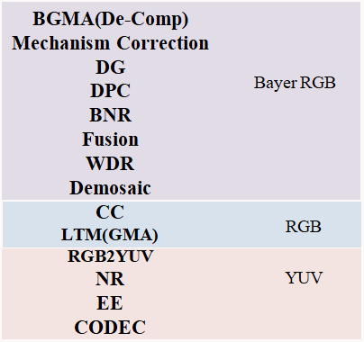

# Algorithm Strategies

*Module Ordering in Algorithm Design Should Be Cost-Driven, While ISP Debugging Must Follow Signal Dependency.*

[Defog - Dark_Channel_Prior_2:Basic model and Cover by Object Distance](Algorithm_Strategies/Defog_-_Dark_Channel_Prior_2_Basic_model_and_Cover_.md)

[Hidden Cost - Sorting](Algorithm_Strategies/Hidden_Cost_-_Sorting_.md)