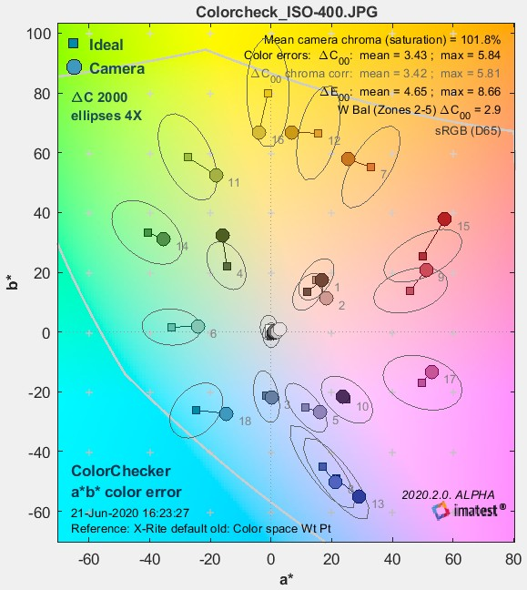

# Color fidelity expectations

| Name | description |
| --- | --- |
| C00 | the chroma (saturation) distance in CIE2000 standard. |
| E00 | the Error Rate include Luminance, Chromiance and Chroma. |